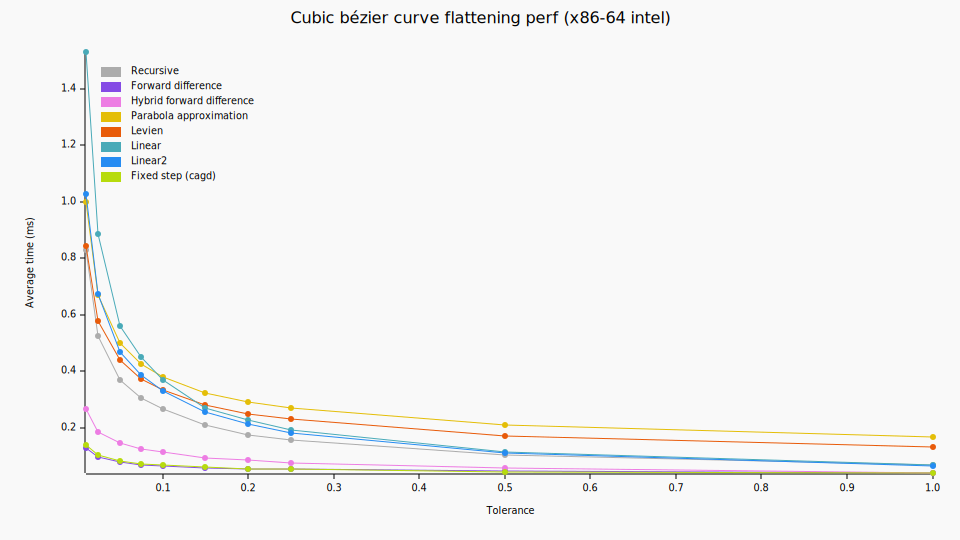
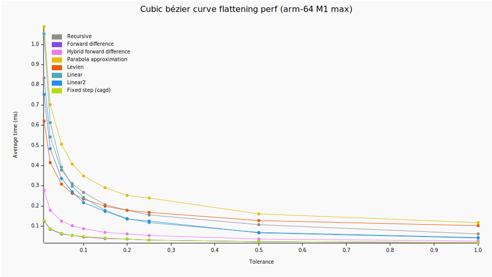
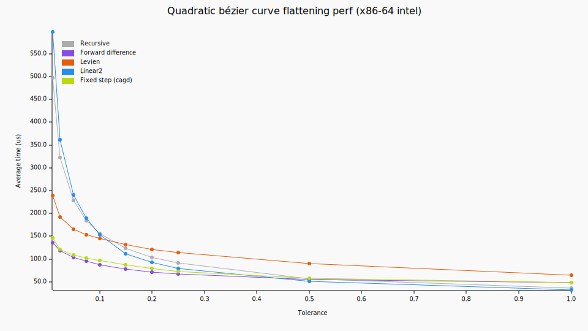
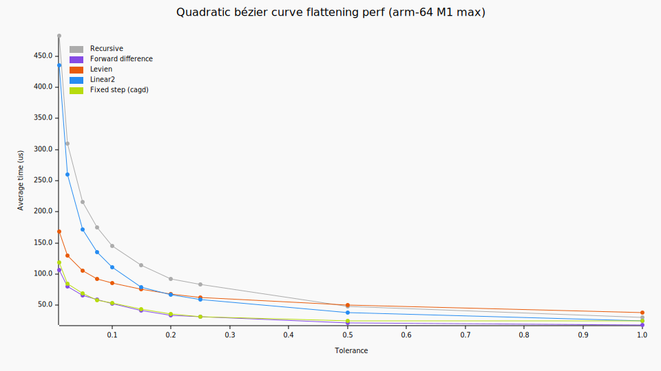
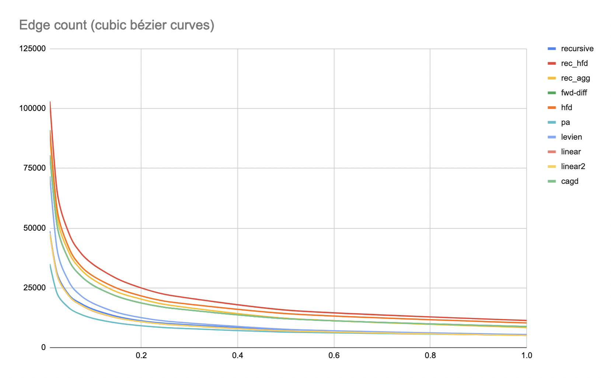
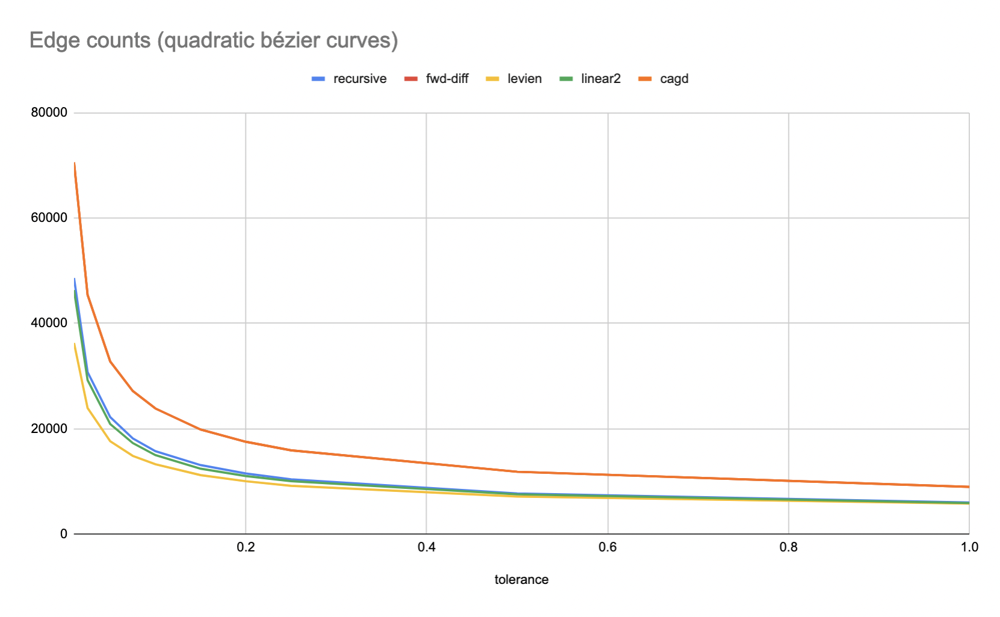

### Performance

Lower is better






### Edge count

Lower is better



Cubic bézier curves:

|tolerance | 0.01| 0.025| 0.05| 0.1| 0.15| 0.2| 0.25| 0.3| 0.4| 0.7| 1|
|----------| -----:| -----:| -----:| -----:| -----:| -----:| -----:| -----:| -----:| -----:| -----:|
|recursive | 48599 | 31379 | 22026 | 16001 | 12982 | 11170 | 10120 | 9354 | 8198 | 6226 | 5329 |
|rec_hfd   | 102948 | 65593 | 47681 | 34829 | 28842 | 24987 | 22259 | 20350 | 17661 | 13408 | 11403 |
|rec_agg   | 88346 | 54968 | 39697 | 28462 | 23287 | 20322 | 18079 | 16262 | 13948 | 10339 | 8477 |
|fwd-diff  | 80422 | 51199 | 36487 | 26070 | 21460 | 18682 | 16842 | 15419 | 13482 | 10411 | 8873 |
|hfd       | 90911 | 58036 | 41569 | 29922 | 24843 | 21646 | 19431 | 17777 | 15673 | 12285 | 10377 |
|pa        | 34988 | 22764 | 16616 | 12273 | 10329 | 9188 | 8422 | 7850 | 7102 | 5813 | 5278 |
|levien    | 71630 | 41250 | 27510 | 18549 | 14730 | 12570 | 11149 | 10121 | 8676 | 6576 | 5505 |
|linear    | 47795 | 30406 | 21550 | 15306 | 12467 | 10876 | 9809 | 8957 | 7829 | 5942 | 5147 |
|linear2   | 47866 | 30480 | 21582 | 15398 | 12510 | 10904 | 9821 | 8970 | 7835 | 5944 | 5151 |
|cagd      | 80422 | 51199 | 36487 | 26070 | 21460 | 18682 | 16842 | 15419 | 13482 | 10411 | 8873 |

  

Quadratic bézier curves:

|tolerance | 0.01| 0.025| 0.05| 0.1| 0.15| 0.2| 0.25| 0.3| 0.4| 0.7| 1|
|----------| -----:| -----:| -----:| -----:| -----:| -----:| -----:| -----:| -----:| -----:| -----:|
|recursive | 48611 | 30764 | 22212 | 15762 | 13117 | 11519 | 10406 | 9547 | 8420 | 6893 | 6016 |
|fwd-diff  | 70558 | 45416 | 32772 | 23852 | 19859 | 17537 | 15917 | 14640 | 13074 | 10316 | 8989 |
|levien    | 36291 | 23934 | 17647 | 13269 | 11208 | 10060 | 9182 | 8624 | 7810 | 6473 | 5798 |
|linear2   | 46321 | 29228 | 20907 | 15016 | 12432 | 11034 | 10068 | 9206 | 8254 | 6723 | 5919 |
|cagd      | 70558 | 45416 | 32772 | 23852 | 19859 | 17537 | 15917 | 14640 | 13074 | 10316 | 8989 |

Notes:
- The parabola approximation implementation is probably buggy.
- Raph Levien's method is very competitive with quadratic curves but there might be better compromises with cubics. The perf scales very well with very low tolerance thresholds. The `t` values are mapped incorrectly back to the cubic curve (bug in lyon's implementation).
- cairo's flattening implementation is a simple recursion using distance between the control points and the baseline as the flattening criterion (similar to `recursive`). See `_cairo_spline_decompose_into`


Color palette used for the perf graphs:
```
recursive acacac
levien e85b0a
linear2 268cf2
cagd b7db0d
fwd-diff 854be5
hfd ed7de3
linear 49aab8
pa e4be08
```